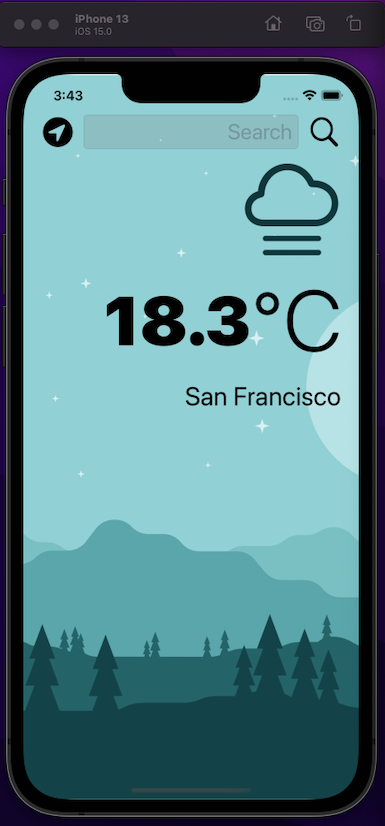

#  Clima

## Making this application I've learned:
* How to create a dark-mode enabled app.
* How to use vector images as image assets.
* Learn to use the UITextField to get user input. 
* Learn about the delegate pattern.
* Swift protocols and extensions. 
* Swift guard keyword. 
* Swift computed properties.
* Swift closures and completion handlers.
* Learn to use URLSession to network and make HTTP requests.
* Parse JSON with the native Encodable and Decodable protocols. 
* Learn to use Grand Central Dispatch to fetch the main thread.
* Learn to use Core Location to get the current location from the phone GPS. 

## What I got

By the end of this project, i got an beautifull, dark-mode enabled weather app that can use GPS location data to search the city temperature and show to the user.

>This is a companion project to The App Brewery's Complete App Development Bootcamp completed by Luiz Silva.
